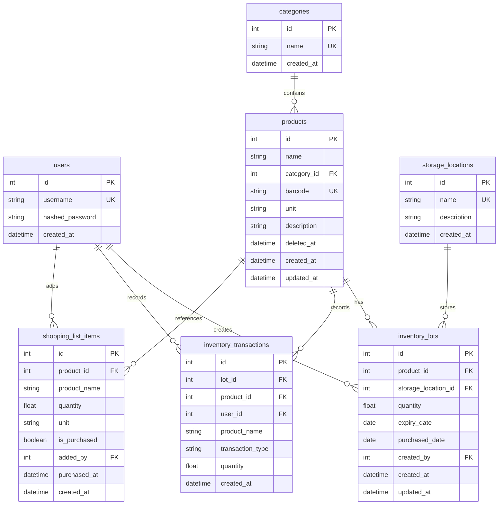

# データベース設計書

## 改訂履歴

| 版 | 日付 | 変更内容 |
|---|------|---------|
| 1.0 | 2025-03-10 | 初版作成 |

## 1. 要件サマリー

### 必須要件
- ✅ 同じ商品で賞味期限が異なる在庫を複数管理（ロット管理）
- ✅ 保管場所の区別（冷蔵庫、パントリーなど）
- ✅ 商品削除後も過去の履歴は保持
- ✅ 容量・メーカー違いは別商品として管理
- ✅ 買い物リスト管理機能

### 対象外
- ❌ 在庫最低数の設定
- ❌ 購入先情報
- ❌ 価格情報
- ❌ ユーザー権限管理

## 2. ER図



## 3. テーブル定義

### 3.1 users（ユーザー）

**用途:** システムを利用する家族メンバーの情報を管理

| カラム名 | 型 | NULL | デフォルト | 制約 | 説明 |
|---------|-----|------|-----------|------|------|
| id | INTEGER | NO | AUTO_INCREMENT | PRIMARY KEY | ユーザーID |
| username | VARCHAR(50) | NO | - | UNIQUE | ユーザー名 |
| hashed_password | VARCHAR(255) | NO | - | - | ハッシュ化パスワード |
| created_at | DATETIME | NO | CURRENT_TIMESTAMP | - | 作成日時 |

**インデックス:**
- PRIMARY KEY (id)
- UNIQUE INDEX (username)

**備考:**
- パスワードはbcryptでハッシュ化して保存
- 権限管理は不要のため、roleカラムは追加しない

---

### 3.2 categories（カテゴリ）

**用途:** 商品を分類するためのカテゴリマスタ

| カラム名 | 型 | NULL | デフォルト | 制約 | 説明 |
|---------|-----|------|-----------|------|------|
| id | INTEGER | NO | AUTO_INCREMENT | PRIMARY KEY | カテゴリID |
| name | VARCHAR(50) | NO | - | UNIQUE | カテゴリ名 |
| created_at | DATETIME | NO | CURRENT_TIMESTAMP | - | 作成日時 |

**インデックス:**
- PRIMARY KEY (id)
- UNIQUE INDEX (name)

**データ例:**
- 調味料
- 飲料
- 日用品
- 冷凍食品
- 缶詰

---

### 3.3 storage_locations（保管場所）

**用途:** 在庫の保管場所を管理

| カラム名 | 型 | NULL | デフォルト | 制約 | 説明 |
|---------|-----|------|-----------|------|------|
| id | INTEGER | NO | AUTO_INCREMENT | PRIMARY KEY | 保管場所ID |
| name | VARCHAR(50) | NO | - | UNIQUE | 保管場所名 |
| description | TEXT | YES | NULL | - | 説明 |
| created_at | DATETIME | NO | CURRENT_TIMESTAMP | - | 作成日時 |

**インデックス:**
- PRIMARY KEY (id)
- UNIQUE INDEX (name)

**データ例:**
- 冷蔵庫
- 冷凍庫
- パントリー
- 倉庫
- キッチン棚

---

### 3.4 products（商品マスタ）

**用途:** 管理対象の商品情報

| カラム名 | 型 | NULL | デフォルト | 制約 | 説明 |
|---------|-----|------|-----------|------|------|
| id | INTEGER | NO | AUTO_INCREMENT | PRIMARY KEY | 商品ID |
| name | VARCHAR(255) | NO | - | INDEX | 商品名 |
| category_id | INTEGER | NO | - | FOREIGN KEY | カテゴリID |
| barcode | VARCHAR(50) | YES | NULL | UNIQUE | バーコード（JAN/EANコード） |
| unit | VARCHAR(20) | NO | '個' | - | 単位（個/本/袋/ml/g/kg/L） |
| description | TEXT | YES | NULL | - | 備考（容量、メーカーなど） |
| deleted_at | DATETIME | YES | NULL | INDEX | 削除日時（論理削除） |
| created_at | DATETIME | NO | CURRENT_TIMESTAMP | - | 作成日時 |
| updated_at | DATETIME | NO | CURRENT_TIMESTAMP | ON UPDATE | 更新日時 |

**インデックス:**
- PRIMARY KEY (id)
- INDEX (name)
- UNIQUE INDEX (barcode)
- INDEX (category_id)
- INDEX (deleted_at)

**外部キー:**
- category_id → categories(id) ON DELETE RESTRICT

**備考:**
- deleted_atがNULLの商品のみ有効
- 同じ商品でも容量・メーカーが違えば別レコード
- 例: 「キッコーマン醤油 500ml」と「キッコーマン醤油 1L」は別商品

---

### 3.5 inventory_lots（在庫ロット）

**用途:** 賞味期限・保管場所ごとの在庫を管理

| カラム名 | 型 | NULL | デフォルト | 制約 | 説明 |
|---------|-----|------|-----------|------|------|
| id | INTEGER | NO | AUTO_INCREMENT | PRIMARY KEY | ロットID |
| product_id | INTEGER | NO | - | FOREIGN KEY, INDEX | 商品ID |
| storage_location_id | INTEGER | NO | - | FOREIGN KEY, INDEX | 保管場所ID |
| quantity | DECIMAL(10,2) | NO | 0 | CHECK >= 0 | 在庫数 |
| expiry_date | DATE | YES | NULL | INDEX | 賞味期限 |
| purchased_date | DATE | YES | NULL | - | 購入日 |
| created_by | INTEGER | NO | - | FOREIGN KEY | 作成者（ユーザーID） |
| created_at | DATETIME | NO | CURRENT_TIMESTAMP | - | 作成日時 |
| updated_at | DATETIME | NO | CURRENT_TIMESTAMP | ON UPDATE | 更新日時 |

**インデックス:**
- PRIMARY KEY (id)
- INDEX (product_id)
- INDEX (storage_location_id)
- INDEX (expiry_date)
- INDEX (product_id, storage_location_id, expiry_date) ※複合インデックス

**外部キー:**
- product_id → products(id) ON DELETE RESTRICT
- storage_location_id → storage_locations(id) ON DELETE RESTRICT
- created_by → users(id) ON DELETE RESTRICT

**制約:**
- CHECK (quantity >= 0)

**備考:**
- 同じ商品でも賞味期限や保管場所が異なれば別ロット
- quantityが0になったロットは削除せず保持（履歴として）
- 例: 「醤油 500ml」を3/31期限で冷蔵庫に2本、4/15期限でパントリーに3本持つ場合、2つのロットレコードが存在

---

### 3.6 inventory_transactions（在庫取引履歴）

**用途:** 在庫の増減履歴を記録

| カラム名 | 型 | NULL | デフォルト | 制約 | 説明 |
|---------|-----|------|-----------|------|------|
| id | INTEGER | NO | AUTO_INCREMENT | PRIMARY KEY | 履歴ID |
| lot_id | INTEGER | YES | NULL | FOREIGN KEY, INDEX | ロットID |
| product_id | INTEGER | YES | NULL | INDEX | 商品ID（削除対策） |
| user_id | INTEGER | NO | - | FOREIGN KEY, INDEX | 実行ユーザーID |
| product_name | VARCHAR(255) | NO | - | - | 商品名（削除対策） |
| transaction_type | VARCHAR(20) | NO | - | - | 取引種別（購入/使用） |
| quantity | DECIMAL(10,2) | NO | - | - | 数量 |
| storage_location_name | VARCHAR(50) | YES | NULL | - | 保管場所名（参照用） |
| expiry_date | DATE | YES | NULL | - | 賞味期限（参照用） |
| created_at | DATETIME | NO | CURRENT_TIMESTAMP | INDEX | 作成日時 |

**インデックス:**
- PRIMARY KEY (id)
- INDEX (lot_id)
- INDEX (product_id)
- INDEX (user_id)
- INDEX (created_at)

**外部キー:**
- lot_id → inventory_lots(id) ON DELETE SET NULL
- user_id → users(id) ON DELETE RESTRICT

**備考:**
- lot_id と product_id は NULL 許可（商品やロット削除後も履歴を保持）
- product_name など非正規化データを保持（削除された商品でも履歴表示可能）
- transaction_type の値: '購入', '使用'

---

### 3.7 shopping_list_items（買い物リスト）

**用途:** 購入が必要な商品のリストを管理

| カラム名 | 型 | NULL | デフォルト | 制約 | 説明 |
|---------|-----|------|-----------|------|------|
| id | INTEGER | NO | AUTO_INCREMENT | PRIMARY KEY | リストID |
| product_id | INTEGER | YES | NULL | FOREIGN KEY, INDEX | 商品ID |
| product_name | VARCHAR(255) | NO | - | - | 商品名 |
| quantity | DECIMAL(10,2) | NO | 1 | - | 必要数量 |
| unit | VARCHAR(20) | NO | '個' | - | 単位 |
| is_purchased | BOOLEAN | NO | FALSE | INDEX | 購入済みフラグ |
| added_by | INTEGER | NO | - | FOREIGN KEY | 追加者（ユーザーID） |
| purchased_at | DATETIME | YES | NULL | - | 購入日時 |
| created_at | DATETIME | NO | CURRENT_TIMESTAMP | INDEX | 作成日時 |

**インデックス:**
- PRIMARY KEY (id)
- INDEX (product_id)
- INDEX (is_purchased)
- INDEX (created_at)

**外部キー:**
- product_id → products(id) ON DELETE SET NULL
- added_by → users(id) ON DELETE RESTRICT

**備考:**
- product_idがNULLの場合は手動入力された商品（商品マスタに未登録）
- is_purchased が FALSE のアイテムが「未購入」の買い物リスト
- 購入完了後は is_purchased を TRUE にし、purchased_at に日時を記録
- 定期的に古い購入済みアイテムを削除またはアーカイブ

---

## 4. リレーションシップ

### 4.1 主要な関連

```
users (1) ──< (N) inventory_lots
  └─ 1人のユーザーが複数のロットを作成

users (1) ──< (N) inventory_transactions
  └─ 1人のユーザーが複数の取引を記録

users (1) ──< (N) shopping_list_items
  └─ 1人のユーザーが複数のアイテムをリストに追加

categories (1) ──< (N) products
  └─ 1つのカテゴリに複数の商品が所属

products (1) ──< (N) inventory_lots
  └─ 1つの商品が複数のロット（賞味期限・保管場所違い）を持つ

storage_locations (1) ──< (N) inventory_lots
  └─ 1つの保管場所に複数のロットが保管される

inventory_lots (1) ──< (N) inventory_transactions
  └─ 1つのロットに対して複数の取引が発生

products (1) ──< (N) shopping_list_items
  └─ 1つの商品が複数の買い物リストアイテムに含まれる（時系列で）
```

## 5. 主要なユースケースとデータフロー

### 5.1 商品を購入して在庫に追加

**フロー:**
1. ユーザーが商品を選択
2. 数量、賞味期限、保管場所を入力
3. システムが該当するロットを検索
   - 同じ product_id, storage_location_id, expiry_date のロットが存在するか
4. 存在する場合：
   - 既存ロットの quantity を加算
5. 存在しない場合：
   - 新規ロットレコードを作成
6. inventory_transactions に履歴を記録（transaction_type='購入'）

**関連テーブル:**
- inventory_lots (更新または作成)
- inventory_transactions (作成)

---

### 5.2 在庫から商品を使用

**フロー:**
1. ユーザーが商品を選択
2. 該当商品のロット一覧を表示（賞味期限が近い順）
3. ユーザーがロットと数量を選択
4. システムがロットの quantity から減算
5. inventory_transactions に履歴を記録（transaction_type='使用'）

**関連テーブル:**
- inventory_lots (更新)
- inventory_transactions (作成)

**バリデーション:**
- quantity が不足していないかチェック

---

### 5.3 商品を削除（論理削除）

**フロー:**
1. ユーザーが商品の削除を実行
2. システムが products.deleted_at に現在日時を設定
3. 関連する inventory_lots は残す（参照のみ不可にする）
4. 過去の inventory_transactions は保持される（product_name が保存されているため）

**関連テーブル:**
- products (更新)

**備考:**
- 完全削除ではなく論理削除
- 削除された商品は一覧に表示されない（WHERE deleted_at IS NULL）
- 履歴は product_name で表示可能

---

### 5.4 買い物リストに追加

**フロー:**
1. ユーザーが商品を選択（または手動入力）
2. 必要数量を入力
3. shopping_list_items に新規レコード作成

**関連テーブル:**
- shopping_list_items (作成)

---

### 5.5 買い物リストから購入

**フロー:**
1. 買い物リストを確認
2. 商品を購入
3. is_purchased を TRUE に更新
4. purchased_at に日時を記録
5. （オプション）そのまま在庫に追加する場合は「5.1 商品を購入」フローを実行

**関連テーブル:**
- shopping_list_items (更新)
- inventory_lots (作成または更新) ※オプション

---

## 6. 正規化の検証

### 6.1 第1正規形（1NF）
✅ すべてのカラムが単一値（配列や繰り返しグループなし）

### 6.2 第2正規形（2NF）
✅ すべての非キー属性が主キーに完全関数従属

### 6.3 第3正規形（3NF）
✅ 非キー属性間の推移的関数従属なし

### 6.4 非正規化の箇所

**意図的な非正規化（パフォーマンスと履歴保持のため）:**

#### inventory_transactions テーブル
- `product_name`: 商品が削除されても履歴で名前を表示するため
- `storage_location_name`: 保管場所が削除されても履歴で場所を表示するため
- `expiry_date`: ロットが削除されても履歴で賞味期限を表示するため

**理由:** 履歴は過去の事実を記録するため、マスタデータの削除・変更の影響を受けないようにする

#### shopping_list_items テーブル
- `product_name`, `unit`: 商品が削除されてもリストに名前と単位を表示するため

**理由:** リスト作成時の商品情報を保持

---

## 7. インデックス戦略

### 7.1 検索パフォーマンス向上

```sql
-- 商品名での検索（あいまい検索）
CREATE INDEX idx_products_name ON products(name);

-- 有効な商品の取得（論理削除フィルタ）
CREATE INDEX idx_products_deleted_at ON products(deleted_at);

-- 賞味期限での検索・ソート
CREATE INDEX idx_inventory_lots_expiry_date ON inventory_lots(expiry_date);

-- ロット検索の複合インデックス（同一ロット判定用）
CREATE INDEX idx_inventory_lots_composite 
  ON inventory_lots(product_id, storage_location_id, expiry_date);

-- 履歴の日時範囲検索
CREATE INDEX idx_inventory_transactions_created_at 
  ON inventory_transactions(created_at);

-- 買い物リストの未購入アイテム取得
CREATE INDEX idx_shopping_list_is_purchased 
  ON shopping_list_items(is_purchased);
```

---

## 8. データ整合性ルール

### 8.1 制約

1. **在庫数は0以上**
   ```sql
   CHECK (inventory_lots.quantity >= 0)
   ```

2. **トランザクションタイプは購入または使用のみ**
   ```sql
   CHECK (transaction_type IN ('購入', '使用'))
   ```

3. **商品削除時のカスケード制御**
   - products 削除時 → inventory_lots は削除しない（RESTRICT）
   - inventory_lots 削除時 → inventory_transactions の lot_id を NULL に（SET NULL）

### 8.2 アプリケーション層での検証

1. **在庫減算時の数量チェック**
   - 使用数量 <= ロットの現在在庫数

2. **賞味期限の妥当性チェック**
   - 賞味期限 >= 購入日

3. **論理削除された商品の制御**
   - 削除済み商品は新規ロット作成不可
   - 既存ロットの更新は可能（使用など）

---

## 9. マイグレーション戦略

### 9.1 現行システムからの移行

**現行テーブル → 新テーブルの対応:**

```
users → users（変更なし）
categories → categories（変更なし）
products → products（deleted_at, description, updated_at を追加）
inventory → 廃止
  └─ inventory_lots へ移行（保管場所は初期値、賞味期限は NULL）
inventory_history → inventory_transactions へ移行（カラム追加・変更）
```

**新規テーブル:**
- storage_locations
- shopping_list_items

### 9.2 移行手順

1. **storage_locations の初期データ作成**
   ```sql
   INSERT INTO storage_locations (name, description) VALUES
   ('パントリー', 'デフォルト保管場所'),
   ('冷蔵庫', NULL),
   ('冷凍庫', NULL);
   ```

2. **inventory → inventory_lots の移行**
   ```sql
   INSERT INTO inventory_lots 
     (product_id, storage_location_id, quantity, expiry_date, purchased_date, created_by)
   SELECT 
     product_id,
     1, -- デフォルト保管場所ID（パントリー）
     quantity,
     expiry_date, -- 既存データがあればそのまま、なければNULL
     NULL, -- 購入日は不明
     1 -- デフォルトユーザーIDを指定
   FROM inventory;
   ```

3. **inventory_history → inventory_transactions の移行**
   ```sql
   INSERT INTO inventory_transactions
     (lot_id, product_id, user_id, product_name, transaction_type, quantity, created_at)
   SELECT
     NULL, -- ロットIDは紐付け不可
     h.product_id,
     h.user_id,
     p.name,
     h.transaction_type,
     h.quantity,
     h.created_at
   FROM inventory_history h
   JOIN products p ON h.product_id = p.id;
   ```

---

## 10. パフォーマンス考慮事項

### 10.1 想定データ量

| テーブル | レコード数（1年後） | 備考 |
|---------|-------------------|------|
| users | 〜10 | 家族メンバー |
| categories | 〜20 | カテゴリ数 |
| products | 〜200 | 商品マスタ（削除含む） |
| storage_locations | 〜10 | 保管場所 |
| inventory_lots | 〜300 | 有効ロット |
| inventory_transactions | 〜10,000 | 年間取引履歴 |
| shopping_list_items | 〜100 | 買い物リスト（定期削除） |

### 10.2 最適化ポイント

1. **inventory_lots の自動クリーンアップ**
   - quantity = 0 かつ 作成から6ヶ月経過したロットを削除

2. **inventory_transactions のアーカイブ**
   - 1年以上前の履歴を別テーブルへアーカイブ

3. **shopping_list_items の定期削除**
   - 購入済み（is_purchased = TRUE）かつ 30日経過したアイテムを削除

---

## 11. セキュリティ考慮事項

1. **パスワード管理**
   - bcryptでハッシュ化（72バイト制限に注意）
   - 平文パスワードは保存しない

2. **SQLインジェクション対策**
   - ORMを使用（SQLAlchemy）
   - プリペアドステートメント利用

3. **認証**
   - JWT トークン（有効期限30分）
   - トークンリフレッシュ機能の検討

---

## 12. 今後の拡張可能性

### 12.1 将来的に追加検討

1. **価格情報管理**
   - inventory_lots に purchase_price カラム追加
   - 購入先マスタテーブル追加

2. **アラート設定**
   - products に min_quantity（最低在庫数）カラム追加
   - alert_settings テーブル追加

3. **レシピ管理**
   - recipes テーブル
   - recipe_ingredients テーブル（多対多）

4. **バーコード複数対応**
   - product_barcodes テーブル（1商品に複数バーコード）

---

## 13. 補足資料

### 13.1 サンプルデータ

**categories:**
```sql
INSERT INTO categories (name) VALUES
('調味料'), ('飲料'), ('日用品'), ('冷凍食品'), ('缶詰');
```

**storage_locations:**
```sql
INSERT INTO storage_locations (name, description) VALUES
('冷蔵庫', '温度管理が必要な食品'),
('冷凍庫', '長期保存用'),
('パントリー', '常温保存可能な食品'),
('キッチン棚', '調味料や日用品'),
('倉庫', 'ストック品');
```

**products:**
```sql
INSERT INTO products (name, category_id, barcode, unit, description) VALUES
('キッコーマン醤油 500ml', 1, '4901515001234', 'ml', 'キッコーマン しょうゆ 500ml'),
('キッコーマン醤油 1L', 1, '4901515001241', 'ml', 'キッコーマン しょうゆ 1L'),
('コカ・コーラ 1.5L', 2, '4902102001234', 'L', 'コカ・コーラ ペットボトル'),
('トイレットペーパー 12ロール', 3, NULL, 'ロール', 'ダブル 12ロール');
```

### 13.2 よくあるクエリ

**賞味期限が近い商品の取得（30日以内）:**
```sql
SELECT 
  p.name,
  l.quantity,
  l.expiry_date,
  s.name as storage_location
FROM inventory_lots l
JOIN products p ON l.product_id = p.id
JOIN storage_locations s ON l.storage_location_id = s.id
WHERE p.deleted_at IS NULL
  AND l.expiry_date IS NOT NULL
  AND l.expiry_date <= DATE_ADD(CURRENT_DATE, INTERVAL 30 DAY)
  AND l.quantity > 0
ORDER BY l.expiry_date ASC;
```

**商品ごとの総在庫数:**
```sql
SELECT 
  p.id,
  p.name,
  SUM(l.quantity) as total_quantity,
  p.unit
FROM products p
LEFT JOIN inventory_lots l ON p.id = l.product_id
WHERE p.deleted_at IS NULL
GROUP BY p.id, p.name, p.unit
ORDER BY total_quantity ASC;
```

**未購入の買い物リスト:**
```sql
SELECT 
  id,
  product_name,
  quantity,
  unit,
  added_by,
  created_at
FROM shopping_list_items
WHERE is_purchased = FALSE
ORDER BY created_at ASC;
```

---

## 14. レビューチェックリスト

- [x] 要件を満たしているか
- [x] 正規化されているか
- [x] 適切な非正規化が行われているか
- [x] インデックスが適切に設定されているか
- [x] 外部キー制約が適切か
- [x] NULL許可が適切か
- [x] データ型が適切か
- [x] 将来の拡張性を考慮しているか

---

この設計書をレビューして、修正点や追加要望があればお知らせください。
