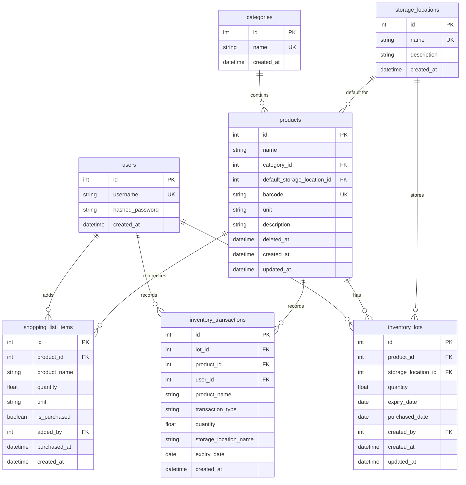

# データベース設計書

## 1. 設計方針

### 1.1 核心コンセプト

**「普段は最小限、必要な時だけ詳細を」**

- 基本は「商品 + 数量」だけで入力完結
- 保管場所は商品ごとのデフォルト値を使用（変更可能）
- 賞味期限は常に入力欄を表示、未入力なら NULL
- ユーザーが都度、詳細度を選択できる柔軟性

### 1.2 要件サマリー

**必須要件:**
- 同じ商品で賞味期限が異なる在庫を複数管理（ロット管理）
- 保管場所の区別（冷蔵庫、パントリーなど）
- 商品削除後も過去の履歴は保持
- 容量・メーカー違いは別商品として管理
- 買い物リスト管理機能
- 最小限の入力で使える

**対象外:**
- 在庫最低数の設定
- 購入先情報
- 価格情報
- ユーザー権限管理
- 商品ごとの賞味期限管理フラグ

## 2. ER図



## 3. テーブル定義

### 3.1 users（ユーザー）

**用途:** システムを利用する家族メンバーの情報を管理

| カラム名 | 型 | NULL | デフォルト | 制約 | 説明 |
|---------|-----|------|-----------|------|------|
| id | INTEGER | NO | AUTO_INCREMENT | PRIMARY KEY | ユーザーID |
| username | VARCHAR(50) | NO | - | UNIQUE | ユーザー名 |
| hashed_password | VARCHAR(255) | NO | - | - | ハッシュ化パスワード |
| created_at | DATETIME | NO | CURRENT_TIMESTAMP | - | 作成日時 |

**インデックス:**
- PRIMARY KEY (id)
- UNIQUE INDEX (username)

**備考:**
- パスワードはbcryptでハッシュ化（72バイト制限に注意）
- 権限管理は不要のため、roleカラムなし

---

### 3.2 categories（カテゴリ）

**用途:** 商品を分類するためのカテゴリマスタ

| カラム名 | 型 | NULL | デフォルト | 制約 | 説明 |
|---------|-----|------|-----------|------|------|
| id | INTEGER | NO | AUTO_INCREMENT | PRIMARY KEY | カテゴリID |
| name | VARCHAR(50) | NO | - | UNIQUE | カテゴリ名 |
| created_at | DATETIME | NO | CURRENT_TIMESTAMP | - | 作成日時 |

**インデックス:**
- PRIMARY KEY (id)
- UNIQUE INDEX (name)

**初期データ例:**
```sql
INSERT INTO categories (name) VALUES
('調味料'),
('飲料'),
('日用品'),
('冷凍食品'),
('缶詰'),
('生鮮食品');
```

---

### 3.3 storage_locations（保管場所）

**用途:** 在庫の保管場所を管理

| カラム名 | 型 | NULL | デフォルト | 制約 | 説明 |
|---------|-----|------|-----------|------|------|
| id | INTEGER | NO | AUTO_INCREMENT | PRIMARY KEY | 保管場所ID |
| name | VARCHAR(50) | NO | - | UNIQUE | 保管場所名 |
| description | TEXT | YES | NULL | - | 説明 |
| created_at | DATETIME | NO | CURRENT_TIMESTAMP | - | 作成日時 |

**インデックス:**
- PRIMARY KEY (id)
- UNIQUE INDEX (name)

**初期データ例:**
```sql
INSERT INTO storage_locations (name, description) VALUES
('パントリー', '常温保存可能な食品や調味料'),
('冷蔵庫', '温度管理が必要な食品'),
('冷凍庫', '長期保存用'),
('キッチン棚', '調味料や日用品'),
('倉庫', 'ストック品');
```

---

### 3.4 products（商品マスタ）

**用途:** 管理対象の商品情報

| カラム名 | 型 | NULL | デフォルト | 制約 | 説明 |
|---------|-----|------|-----------|------|------|
| id | INTEGER | NO | AUTO_INCREMENT | PRIMARY KEY | 商品ID |
| name | VARCHAR(255) | NO | - | INDEX | 商品名 |
| category_id | INTEGER | NO | - | FOREIGN KEY | カテゴリID |
| default_storage_location_id | INTEGER | NO | - | FOREIGN KEY | デフォルト保管場所ID |
| barcode | VARCHAR(50) | YES | NULL | UNIQUE | バーコード（JAN/EAN） |
| unit | VARCHAR(20) | NO | '個' | - | 単位（個/本/袋/ml/g/kg/L） |
| description | TEXT | YES | NULL | - | 備考（容量、メーカーなど） |
| deleted_at | DATETIME | YES | NULL | INDEX | 削除日時（論理削除） |
| created_at | DATETIME | NO | CURRENT_TIMESTAMP | - | 作成日時 |
| updated_at | DATETIME | NO | CURRENT_TIMESTAMP | ON UPDATE | 更新日時 |

**インデックス:**
- PRIMARY KEY (id)
- INDEX (name)
- UNIQUE INDEX (barcode)
- INDEX (category_id)
- INDEX (default_storage_location_id)
- INDEX (deleted_at)

**外部キー:**
- category_id → categories(id) ON DELETE RESTRICT
- default_storage_location_id → storage_locations(id) ON DELETE RESTRICT

**備考:**
- deleted_at が NULL の商品のみ有効
- default_storage_location_id により購入時の保管場所を自動設定
- 同じ商品でも容量・メーカーが違えば別レコード
  - 例: 「キッコーマン醤油 500ml」と「キッコーマン醤油 1L」は別商品

**サンプルデータ:**
```sql
-- パントリーのID=1, 冷蔵庫のID=2 と仮定
INSERT INTO products 
  (name, category_id, default_storage_location_id, barcode, unit, description) 
VALUES
  ('キッコーマン醤油 500ml', 1, 1, '4901515001234', 'ml', 'キッコーマン しょうゆ'),
  ('キッコーマン醤油 1L', 1, 1, '4901515001241', 'ml', 'キッコーマン しょうゆ'),
  ('明治おいしい牛乳 1L', 6, 2, '4902102001234', 'L', '明治 おいしい牛乳'),
  ('コカ・コーラ 1.5L', 2, 1, '4902102112345', 'L', 'コカ・コーラ ペットボトル'),
  ('トイレットペーパー 12ロール', 3, 1, NULL, 'ロール', 'ダブル 12ロール');
```

---

### 3.5 inventory_lots（在庫ロット）

**用途:** 賞味期限・保管場所ごとの在庫を管理

| カラム名 | 型 | NULL | デフォルト | 制約 | 説明 |
|---------|-----|------|-----------|------|------|
| id | INTEGER | NO | AUTO_INCREMENT | PRIMARY KEY | ロットID |
| product_id | INTEGER | NO | - | FOREIGN KEY, INDEX | 商品ID |
| storage_location_id | INTEGER | NO | - | FOREIGN KEY, INDEX | 保管場所ID |
| quantity | DECIMAL(10,2) | NO | 0 | CHECK >= 0 | 在庫数 |
| expiry_date | DATE | YES | NULL | INDEX | 賞味期限（NULL=管理しない） |
| purchased_date | DATE | YES | NULL | - | 購入日 |
| created_by | INTEGER | NO | - | FOREIGN KEY | 作成者（ユーザーID） |
| created_at | DATETIME | NO | CURRENT_TIMESTAMP | - | 作成日時 |
| updated_at | DATETIME | NO | CURRENT_TIMESTAMP | ON UPDATE | 更新日時 |

**インデックス:**
- PRIMARY KEY (id)
- INDEX (product_id)
- INDEX (storage_location_id)
- INDEX (expiry_date)
- INDEX (product_id, storage_location_id, expiry_date) ※複合（ロット検索用）

**外部キー:**
- product_id → products(id) ON DELETE RESTRICT
- storage_location_id → storage_locations(id) ON DELETE RESTRICT
- created_by → users(id) ON DELETE RESTRICT

**制約:**
- CHECK (quantity >= 0)

**ロット統合ルール:**
```
同一ロット = 同じ product_id 
           AND 同じ storage_location_id 
           AND 同じ expiry_date（NULL同士も一致）
```

**使用例:**

```sql
-- 例1: 醤油を2本購入（賞味期限は管理しない）
-- 既存: 醤油(ID=1)・パントリー(ID=1)・NULL のロットに +2
INSERT INTO inventory_lots 
  (product_id, storage_location_id, quantity, expiry_date, created_by)
VALUES (1, 1, 2, NULL, 1)
ON DUPLICATE KEY UPDATE quantity = quantity + 2;

-- 例2: 牛乳を3本購入（賞味期限: 3/20）
-- 新規または既存ロット: 牛乳(ID=3)・冷蔵庫(ID=2)・2025-03-20 に +3
INSERT INTO inventory_lots 
  (product_id, storage_location_id, quantity, expiry_date, created_by)
VALUES (3, 2, 3, '2025-03-20', 1)
ON DUPLICATE KEY UPDATE quantity = quantity + 3;

-- 例3: 牛乳を1本購入（賞味期限入力せず）
-- 牛乳(ID=3)・冷蔵庫(ID=2)・NULL のロットに +1
INSERT INTO inventory_lots 
  (product_id, storage_location_id, quantity, expiry_date, created_by)
VALUES (3, 2, 1, NULL, 1)
ON DUPLICATE KEY UPDATE quantity = quantity + 1;
```

**備考:**
- 同じ商品でも賞味期限や保管場所が異なれば別ロット
- quantity が 0 になったロットは削除せず保持（履歴として）
- expiry_date が NULL のロットは「賞味期限を管理していない在庫」

---

### 3.6 inventory_transactions（在庫取引履歴）

**用途:** 在庫の増減履歴を記録（監査証跡）

| カラム名 | 型 | NULL | デフォルト | 制約 | 説明 |
|---------|-----|------|-----------|------|------|
| id | INTEGER | NO | AUTO_INCREMENT | PRIMARY KEY | 履歴ID |
| lot_id | INTEGER | YES | NULL | FOREIGN KEY, INDEX | ロットID（削除時NULL） |
| product_id | INTEGER | YES | NULL | INDEX | 商品ID（削除対策） |
| user_id | INTEGER | NO | - | FOREIGN KEY, INDEX | 実行ユーザーID |
| product_name | VARCHAR(255) | NO | - | - | 商品名（削除対策） |
| transaction_type | VARCHAR(20) | NO | - | - | 取引種別（購入/使用） |
| quantity | DECIMAL(10,2) | NO | - | - | 数量 |
| storage_location_name | VARCHAR(50) | YES | NULL | - | 保管場所名（参照用） |
| expiry_date | DATE | YES | NULL | - | 賞味期限（参照用） |
| created_at | DATETIME | NO | CURRENT_TIMESTAMP | INDEX | 取引日時 |

**インデックス:**
- PRIMARY KEY (id)
- INDEX (lot_id)
- INDEX (product_id)
- INDEX (user_id)
- INDEX (created_at)

**外部キー:**
- lot_id → inventory_lots(id) ON DELETE SET NULL
- user_id → users(id) ON DELETE RESTRICT

**備考:**
- lot_id と product_id は NULL 許可（削除後も履歴を保持）
- product_name など非正規化データを保持（削除された商品でも履歴表示可能）
- transaction_type の値: '購入', '使用'

---

### 3.7 shopping_list_items（買い物リスト）

**用途:** 購入が必要な商品のリストを管理

| カラム名 | 型 | NULL | デフォルト | 制約 | 説明 |
|---------|-----|------|-----------|------|------|
| id | INTEGER | NO | AUTO_INCREMENT | PRIMARY KEY | リストID |
| product_id | INTEGER | YES | NULL | FOREIGN KEY, INDEX | 商品ID（手動入力時NULL） |
| product_name | VARCHAR(255) | NO | - | - | 商品名 |
| quantity | DECIMAL(10,2) | NO | 1 | - | 必要数量 |
| unit | VARCHAR(20) | NO | '個' | - | 単位 |
| is_purchased | BOOLEAN | NO | FALSE | INDEX | 購入済みフラグ |
| added_by | INTEGER | NO | - | FOREIGN KEY | 追加者（ユーザーID） |
| purchased_at | DATETIME | YES | NULL | - | 購入日時 |
| created_at | DATETIME | NO | CURRENT_TIMESTAMP | INDEX | 作成日時 |

**インデックス:**
- PRIMARY KEY (id)
- INDEX (product_id)
- INDEX (is_purchased)
- INDEX (created_at)

**外部キー:**
- product_id → products(id) ON DELETE SET NULL
- added_by → users(id) ON DELETE RESTRICT

**備考:**
- product_id が NULL の場合は手動入力された商品（商品マスタに未登録）
- is_purchased が FALSE のアイテムが「未購入」リスト
- 購入完了後は is_purchased を TRUE、purchased_at に日時を記録

---

## 4. 主要なユースケースとデータフロー

### 4.1 商品を購入して在庫に追加（基本フロー）

**入力パターン1: 最小入力**
```
ユーザー入力:
- 商品: 醤油 500ml
- 数量: 2

システム処理:
1. 商品マスタから default_storage_location_id を取得（パントリー）
2. 賞味期限は未入力 → NULL
3. ロット検索: product_id=1, storage_location_id=1, expiry_date=NULL
4. 既存ロットがあれば quantity += 2、なければ新規作成
5. inventory_transactions に履歴記録
```

**入力パターン2: 賞味期限も入力**
```
ユーザー入力:
- 商品: 牛乳 1L
- 数量: 3
- 賞味期限: 2025-03-20

システム処理:
1. デフォルト保管場所: 冷蔵庫
2. ロット検索: product_id=3, storage_location_id=2, expiry_date='2025-03-20'
3. 既存ロットがあれば quantity += 3、なければ新規作成
4. 履歴記録
```

**入力パターン3: 保管場所を変更**
```
ユーザー入力:
- 商品: 醤油 500ml
- 数量: 1
- 保管場所: 冷蔵庫（デフォルトから変更）

システム処理:
1. ロット検索: product_id=1, storage_location_id=2, expiry_date=NULL
2. 既存ロットがあれば quantity += 1、なければ新規作成
3. 履歴記録
```

**SQL例:**
```sql
-- 最小入力時の処理（アプリケーション層）
-- 1. デフォルト保管場所を取得
SELECT default_storage_location_id 
FROM products 
WHERE id = :product_id AND deleted_at IS NULL;

-- 2. 既存ロットを検索
SELECT id, quantity
FROM inventory_lots
WHERE product_id = :product_id
  AND storage_location_id = :storage_location_id
  AND expiry_date IS NULL;

-- 3a. 既存ロットがあれば更新
UPDATE inventory_lots
SET quantity = quantity + :quantity,
    updated_at = CURRENT_TIMESTAMP
WHERE id = :lot_id;

-- 3b. 既存ロットがなければ新規作成
INSERT INTO inventory_lots
  (product_id, storage_location_id, quantity, expiry_date, created_by)
VALUES
  (:product_id, :storage_location_id, :quantity, NULL, :user_id);

-- 4. 履歴を記録
INSERT INTO inventory_transactions
  (lot_id, product_id, user_id, product_name, transaction_type, 
   quantity, storage_location_name, expiry_date)
VALUES
  (:lot_id, :product_id, :user_id, :product_name, '購入',
   :quantity, :storage_location_name, NULL);
```

---

### 4.2 在庫から商品を使用

**フロー:**
```
1. ユーザーが商品を選択
2. システムが該当商品のロット一覧を表示
   - 賞味期限がある場合: 期限が近い順
   - 賞味期限がない場合: 作成日順
3. ユーザーがロットと使用数量を選択
4. システムがロットの quantity から減算
5. inventory_transactions に履歴記録（transaction_type='使用'）
```

**SQL例:**
```sql
-- 1. 該当商品のロット一覧取得（賞味期限順）
SELECT 
  l.id,
  l.quantity,
  l.expiry_date,
  s.name as storage_location
FROM inventory_lots l
JOIN storage_locations s ON l.storage_location_id = s.id
WHERE l.product_id = :product_id
  AND l.quantity > 0
ORDER BY 
  CASE WHEN l.expiry_date IS NULL THEN 1 ELSE 0 END,  -- NULL は最後
  l.expiry_date ASC,  -- 期限が近い順
  l.created_at ASC;   -- 古い順

-- 2. 在庫を減算
UPDATE inventory_lots
SET quantity = quantity - :quantity,
    updated_at = CURRENT_TIMESTAMP
WHERE id = :lot_id
  AND quantity >= :quantity;  -- 在庫不足チェック

-- 3. 履歴を記録
INSERT INTO inventory_transactions
  (lot_id, product_id, user_id, product_name, transaction_type, 
   quantity, storage_location_name, expiry_date)
VALUES
  (:lot_id, :product_id, :user_id, :product_name, '使用',
   :quantity, :storage_location_name, :expiry_date);
```

---

### 4.3 商品を削除（論理削除）

**フロー:**
```
1. ユーザーが商品の削除を実行
2. products.deleted_at に現在日時を設定
3. 関連する inventory_lots は残す（参照は不可に）
4. 過去の inventory_transactions は保持される
```

**SQL例:**
```sql
-- 論理削除
UPDATE products
SET deleted_at = CURRENT_TIMESTAMP,
    updated_at = CURRENT_TIMESTAMP
WHERE id = :product_id;

-- 削除済み商品は一覧から除外
SELECT * FROM products
WHERE deleted_at IS NULL;
```

---

### 4.4 在庫一覧の取得

**全商品の総在庫数を取得:**
```sql
SELECT 
  p.id,
  p.name,
  p.unit,
  c.name as category_name,
  COALESCE(SUM(l.quantity), 0) as total_quantity,
  COUNT(DISTINCT l.id) as lot_count
FROM products p
LEFT JOIN categories c ON p.category_id = c.id
LEFT JOIN inventory_lots l ON p.id = l.product_id
WHERE p.deleted_at IS NULL
GROUP BY p.id, p.name, p.unit, c.name
ORDER BY total_quantity ASC;
```

**賞味期限が近い商品（30日以内）:**
```sql
SELECT 
  p.name,
  l.quantity,
  l.expiry_date,
  s.name as storage_location,
  DATEDIFF(l.expiry_date, CURRENT_DATE) as days_until_expiry
FROM inventory_lots l
JOIN products p ON l.product_id = p.id
JOIN storage_locations s ON l.storage_location_id = s.id
WHERE p.deleted_at IS NULL
  AND l.expiry_date IS NOT NULL
  AND l.expiry_date <= DATE_ADD(CURRENT_DATE, INTERVAL 30 DAY)
  AND l.quantity > 0
ORDER BY l.expiry_date ASC;
```

**在庫が少ない商品（5個以下）:**
```sql
SELECT 
  p.name,
  SUM(l.quantity) as total_quantity,
  p.unit
FROM products p
JOIN inventory_lots l ON p.id = l.product_id
WHERE p.deleted_at IS NULL
GROUP BY p.id, p.name, p.unit
HAVING total_quantity <= 5
ORDER BY total_quantity ASC;
```

---

### 4.5 買い物リスト管理

**リストに追加:**
```sql
-- 商品マスタから追加
INSERT INTO shopping_list_items
  (product_id, product_name, quantity, unit, added_by)
SELECT 
  id, name, :quantity, unit, :user_id
FROM products
WHERE id = :product_id;

-- 手動入力で追加（商品マスタに未登録）
INSERT INTO shopping_list_items
  (product_id, product_name, quantity, unit, added_by)
VALUES
  (NULL, :product_name, :quantity, :unit, :user_id);
```

**未購入リストを取得:**
```sql
SELECT 
  id,
  product_name,
  quantity,
  unit,
  created_at
FROM shopping_list_items
WHERE is_purchased = FALSE
ORDER BY created_at ASC;
```

**購入完了:**
```sql
UPDATE shopping_list_items
SET is_purchased = TRUE,
    purchased_at = CURRENT_TIMESTAMP
WHERE id = :item_id;
```

---

## 5. データ整合性とバリデーション

### 5.1 データベース制約

```sql
-- 在庫数は0以上
ALTER TABLE inventory_lots 
ADD CONSTRAINT chk_quantity_positive 
CHECK (quantity >= 0);

-- 取引種別は購入または使用のみ
ALTER TABLE inventory_transactions
ADD CONSTRAINT chk_transaction_type
CHECK (transaction_type IN ('購入', '使用'));
```

### 5.2 アプリケーション層でのバリデーション

**購入時:**
- 商品が削除されていないか（deleted_at IS NULL）
- 数量が正の数か
- 賞味期限が購入日以降か（入力された場合）

**使用時:**
- 使用数量 <= ロットの現在在庫数
- ロットが存在するか

**商品削除時:**
- 現在在庫がある場合は警告を表示
- 強制削除も可能（論理削除なので復元可能）

---

## 6. マイグレーション計画

### 6.1 既存システムからの移行

**ステップ1: 新テーブルの作成**
```sql
-- storage_locations の初期データ
INSERT INTO storage_locations (name, description) VALUES
('パントリー', 'デフォルト保管場所'),
('冷蔵庫', NULL),
('冷凍庫', NULL);
```

**ステップ2: 商品マスタの移行**
```sql
-- products にカラム追加
ALTER TABLE products
ADD COLUMN default_storage_location_id INTEGER,
ADD COLUMN deleted_at DATETIME,
ADD COLUMN updated_at DATETIME DEFAULT CURRENT_TIMESTAMP ON UPDATE CURRENT_TIMESTAMP,
ADD FOREIGN KEY (default_storage_location_id) REFERENCES storage_locations(id);

-- 既存商品にデフォルト保管場所を設定
UPDATE products
SET default_storage_location_id = 1  -- パントリー
WHERE default_storage_location_id IS NULL;
```

**ステップ3: 在庫データの移行**
```sql
-- 旧 inventory → 新 inventory_lots
INSERT INTO inventory_lots 
  (product_id, storage_location_id, quantity, expiry_date, created_by)
SELECT 
  product_id,
  1,  -- デフォルト保管場所（パントリー）
  quantity,
  expiry_date,
  1   -- デフォルトユーザーID
FROM inventory;
```

**ステップ4: 履歴データの移行**
```sql
-- 旧 inventory_history → 新 inventory_transactions
INSERT INTO inventory_transactions
  (lot_id, product_id, user_id, product_name, transaction_type, quantity, created_at)
SELECT
  NULL,  -- ロットIDは紐付け不可
  h.product_id,
  h.user_id,
  p.name,
  h.transaction_type,
  h.quantity,
  h.created_at
FROM inventory_history h
JOIN products p ON h.product_id = p.id;
```

**ステップ5: 旧テーブルの削除**
```sql
-- バックアップ後に削除
DROP TABLE inventory;
DROP TABLE inventory_history;
```

---

## 7. パフォーマンス最適化

### 7.1 インデックス戦略

```sql
-- 商品名での検索（あいまい検索）
CREATE INDEX idx_products_name ON products(name);

-- 有効な商品のフィルタ（論理削除）
CREATE INDEX idx_products_deleted_at ON products(deleted_at);

-- ロット検索の複合インデックス（最重要）
CREATE INDEX idx_inventory_lots_lookup 
ON inventory_lots(product_id, storage_location_id, expiry_date);

-- 賞味期限での検索・ソート
CREATE INDEX idx_inventory_lots_expiry ON inventory_lots(expiry_date);

-- 履歴の日時範囲検索
CREATE INDEX idx_transactions_created_at ON inventory_transactions(created_at);

-- 買い物リストの未購入フィルタ
CREATE INDEX idx_shopping_list_purchased ON shopping_list_items(is_purchased);
```

### 7.2 定期メンテナンス

**在庫ロットのクリーンアップ（月次）:**
```sql
-- quantity=0 かつ 6ヶ月以上前のロットを削除
DELETE FROM inventory_lots
WHERE quantity = 0
  AND updated_at < DATE_SUB(CURRENT_DATE, INTERVAL 6 MONTH);
```

**買い物リストのアーカイブ（週次）:**
```sql
-- 購入済みかつ30日以上前のアイテムを削除
DELETE FROM shopping_list_items
WHERE is_purchased = TRUE
  AND purchased_at < DATE_SUB(CURRENT_DATE, INTERVAL 30 DAY);
```

**履歴のアーカイブ（年次）:**
```sql
-- 1年以上前の履歴を別テーブルへ移動（オプション）
CREATE TABLE inventory_transactions_archive LIKE inventory_transactions;

INSERT INTO inventory_transactions_archive
SELECT * FROM inventory_transactions
WHERE created_at < DATE_SUB(CURRENT_DATE, INTERVAL 1 YEAR);

DELETE FROM inventory_transactions
WHERE created_at < DATE_SUB(CURRENT_DATE, INTERVAL 1 YEAR);
```

---

## 8. セキュリティ考慮事項

### 8.1 パスワード管理

```python
# bcryptでハッシュ化（72バイト制限に注意）
from passlib.context import CryptContext

pwd_context = CryptContext(schemes=["bcrypt"], deprecated="auto")

# パスワードのバイト数チェック
def validate_password(password: str):
    if len(password.encode('utf-8')) > 72:
        raise ValueError("パスワードは72バイト以内にしてください")
    return pwd_context.hash(password)
```

### 8.2 SQLインジェクション対策

- SQLAlchemy（ORM）を使用
- プリペアドステートメント必須
- ユーザー入力を直接SQLに埋め込まない

### 8.3 認証

- JWT トークン（有効期限30分）
- HTTPSでの通信（本番環境）

---

## 9. 将来の拡張可能性

### 9.1 検討中の機能

**価格情報管理:**
```sql
ALTER TABLE inventory_lots
ADD COLUMN purchase_price DECIMAL(10,2);

CREATE TABLE stores (
  id INTEGER PRIMARY KEY,
  name VARCHAR(100),
  ...
);

ALTER TABLE inventory_lots
ADD COLUMN store_id INTEGER,
ADD FOREIGN KEY (store_id) REFERENCES stores(id);
```

**バーコード複数対応:**
```sql
CREATE TABLE product_barcodes (
  id INTEGER PRIMARY KEY,
  product_id INTEGER,
  barcode VARCHAR(50) UNIQUE,
  FOREIGN KEY (product_id) REFERENCES products(id)
);

-- products.barcode を削除
```

**レシピ管理:**
```sql
CREATE TABLE recipes (
  id INTEGER PRIMARY KEY,
  name VARCHAR(255),
  ...
);

CREATE TABLE recipe_ingredients (
  recipe_id INTEGER,
  product_id INTEGER,
  quantity DECIMAL(10,2),
  FOREIGN KEY (recipe_id) REFERENCES recipes(id),
  FOREIGN KEY (product_id) REFERENCES products(id)
);
```

---

## 10. よくある質問（FAQ）

**Q1: 同じ商品で賞味期限が違うものを複数持っている場合、どう管理される？**

A: 別々のロットとして管理されます。

```
例: 牛乳 1L を持っている場合
- ロット1: 賞味期限 3/20、冷蔵庫、2本
- ロット2: 賞味期限 3/25、冷蔵庫、1本
→ 合計3本
```

**Q2: 賞味期限を入力しないとどうなる？**

A: expiry_date が NULL のロットとして管理されます。同じ商品・保管場所で賞味期限を入力しない在庫は1つのロットにまとめられます。

**Q3: 保管場所を変更したい場合は？**

A: 新しいロットとして扱われます。移動機能が必要な場合は別途実装します。

**Q4: 在庫が0になったロットは削除される？**

A: 削除されません。履歴として保持されます。定期的なクリーンアップで古いロットを削除できます。

**Q5: 商品を削除すると過去の履歴も消える？**

A: 消えません。論理削除（deleted_at）なので、履歴は保持されます。

---

## 11. レビューチェックリスト

設計レビュー時の確認項目:

- [x] 最小入力（商品+数量）で使えるか
- [x] 賞味期限はオプションか
- [x] 保管場所のデフォルト値が設定できるか
- [x] 同じ商品で賞味期限違いを管理できるか
- [x] 商品削除後も履歴が残るか
- [x] 買い物リスト機能があるか
- [x] 正規化されているか
- [x] 適切なインデックスが設定されているか
- [x] パフォーマンスを考慮しているか
- [x] 将来の拡張性があるか

---

この設計で実装を進めてよろしいですか？
修正点や追加要望があればお知らせください。
